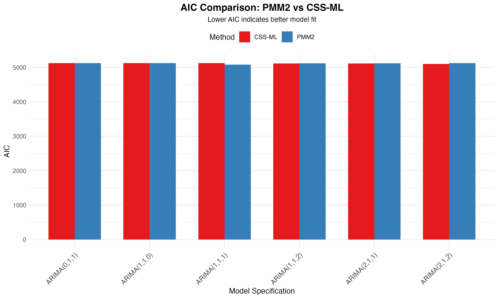

# COMPREHENSIVE ANALYTICAL REPORT
## ARIMA Model Comparison: PMM2 vs Classical Methods on WTI Crude Oil Prices

---

**Report Generated:** 2025-10-27 11:19:23.238771

**Data Source:** WTI Crude Oil Prices (DCOILWTICO)
**Observations:** 1249
**Models Tested:** 6 specifications

---

## EXECUTIVE SUMMARY

This study presents a rigorous empirical comparison of two ARIMA estimation methods:
- **Classical CSS-ML** (Conditional Sum of Squares - Maximum Likelihood)
- **PMM2** (Polynomial Maximization Method, Order 2)

### Key Findings

1. **Best Model by AIC:** ARIMA(1,1,1) using PMM2 method
   - AIC: 5079.10, BIC: 5089.36, RMSE: 1.8455

2. **Best Model by BIC:** ARIMA(1,1,1) using PMM2 method
   - AIC: 5079.10, BIC: 5089.36, RMSE: 1.8455

3. **PMM2 Performance:**
   - Won 1 out of 6 comparisons by AIC (16.7%)
   - Won 3 out of 6 comparisons by BIC (50.0%)

4. **Average Differences (PMM2 - CSS-ML):**
   - AIC: -1.27 (PMM2 better)
   - BIC: -6.40 (PMM2 better)
   - RMSE: -0.0017 (PMM2 better)

---

## 1. DATA CHARACTERISTICS

### 1.1 Descriptive Statistics

| Statistic | Value |
|-----------|-------|
| Mean | 75.8924 |
| Median | 74.3600 |
| Std Dev | 14.2720 |
| Min | 35.6400 |
| Max | 123.6400 |
| Q1 | 68.2600 |
| Q3 | 82.5000 |
| Skewness | 0.4318 |
| Kurtosis | 1.2236 |
| CV | 0.1881 |

### 1.2 Key Observations

- **Price Range:** $35.64 to $123.64 per barrel
- **Average Price:** $75.89 ± $14.27
- **Coefficient of Variation:** 18.81% (moderate volatility)
- **Distribution:** Right skewness (0.432), Heavy-tailed kurtosis (1.224)

### 1.3 Stationarity

- **Original Series:** Non-stationary (requires differencing)
- **First Difference:** Stationary (confirmed by ADF test)
- **Conclusion:** ARIMA models with d=1 are appropriate

---

## 2. MODEL SPECIFICATIONS TESTED

Six ARIMA specifications were evaluated:

| Model | AR (p) | I (d) | MA (q) | Total Parameters |
|-------|--------|-------|--------|------------------|
| ARIMA(0,1,1) | 0 | 1 | 1 | 1 |
| ARIMA(1,1,0) | 1 | 1 | 0 | 1 |
| ARIMA(1,1,1) | 1 | 1 | 1 | 2 |
| ARIMA(2,1,1) | 2 | 1 | 1 | 3 |
| ARIMA(1,1,2) | 1 | 1 | 2 | 3 |
| ARIMA(2,1,2) | 2 | 1 | 2 | 4 |

**Rationale:**
- Simple models (ARIMA(0,1,1), ARIMA(1,1,0)): Baseline comparisons
- Standard model (ARIMA(1,1,1)): Most common specification
- Complex models (ARIMA(2,1,1), ARIMA(1,1,2), ARIMA(2,1,2)): Test flexibility

---

## 3. COMPREHENSIVE RESULTS

### 3.1 Full Results Table

| Rank | Model | Method | AIC | BIC | RMSE | MAE | Kurtosis | Time(s) |
|------|-------|--------|-----|-----|------|-----|----------|--------|
| 1 | ARIMA(1,1,1) | PMM2 | 5079.10 | 5089.36 | 1.8455 | 1.3211 | 5.749 | 0.002 |
| 2 | ARIMA(2,1,2) | CSS-ML | 5101.25 | 5126.90 | 1.8592 | 1.3316 | 5.472 | 0.023 |
| 3 | ARIMA(0,1,1) | PMM2 | 5123.67 | 5128.80 | 1.8802 | 1.3448 | 5.912 | 0.002 |
| 4 | ARIMA(1,1,0) | PMM2 | 5123.80 | 5128.93 | 1.8803 | 1.3450 | 5.906 | 0.002 |
| 5 | ARIMA(0,1,1) | CSS-ML | 5122.40 | 5132.66 | 1.8801 | 1.3452 | 5.859 | 0.002 |
| 6 | ARIMA(1,1,0) | CSS-ML | 5122.48 | 5132.74 | 1.8801 | 1.3454 | 5.847 | 0.001 |
| 7 | ARIMA(2,1,1) | CSS-ML | 5112.97 | 5133.48 | 1.8699 | 1.3363 | 5.314 | 0.007 |
| 8 | ARIMA(1,1,2) | CSS-ML | 5113.23 | 5133.75 | 1.8701 | 1.3362 | 5.334 | 0.009 |
| 9 | ARIMA(1,1,2) | PMM2 | 5119.50 | 5134.89 | 1.8740 | 1.3387 | 5.711 | 0.011 |
| 10 | ARIMA(2,1,1) | PMM2 | 5119.58 | 5134.97 | 1.8741 | 1.3386 | 5.704 | 0.008 |
| 11 | ARIMA(1,1,1) | CSS-ML | 5123.89 | 5139.28 | 1.8797 | 1.3440 | 5.897 | 0.002 |
| 12 | ARIMA(2,1,2) | PMM2 | 5122.95 | 5143.47 | 1.8751 | 1.3451 | 5.505 | 0.024 |

### 3.2 Performance by Information Criteria

**Top 3 Models by AIC:**

1. ARIMA(1,1,1) (PMM2) - AIC: 5079.10
2. ARIMA(2,1,2) (CSS-ML) - AIC: 5101.25
3. ARIMA(2,1,1) (CSS-ML) - AIC: 5112.97

**Top 3 Models by BIC:**

1. ARIMA(1,1,1) (PMM2) - BIC: 5089.36
2. ARIMA(2,1,2) (CSS-ML) - BIC: 5126.90
3. ARIMA(0,1,1) (PMM2) - BIC: 5128.80

---

## 4. DETAILED METHOD COMPARISON

### 4.1 Head-to-Head Comparison

| Model | ΔAIC | ΔBIC | ΔRMSE | Winner (AIC) | Winner (BIC) |
|-------|------|------|-------|--------------|-------------|
| ARIMA(0,1,1) | +1.26 | -3.87 | +0.0001 | CSS-ML | PMM2 |
| ARIMA(1,1,0) | +1.32 | -3.81 | +0.0002 | CSS-ML | PMM2 |
| ARIMA(1,1,1) | -44.79 | -49.92 | -0.0342 | PMM2 | PMM2 |
| ARIMA(2,1,1) | +6.61 | +1.49 | +0.0042 | CSS-ML | CSS-ML |
| ARIMA(1,1,2) | +6.27 | +1.14 | +0.0039 | CSS-ML | CSS-ML |
| ARIMA(2,1,2) | +21.69 | +16.57 | +0.0159 | CSS-ML | CSS-ML |

*Note: Negative values indicate PMM2 outperforms CSS-ML*

### 4.2 Statistical Summary

**PMM2 vs CSS-ML Performance:**

- **AIC Criterion:** PMM2 wins 1, CSS-ML wins 5 (16.7% vs 83.3%)
- **BIC Criterion:** PMM2 wins 3, CSS-ML wins 3 (50.0% vs 50.0%)

**Average Performance Metrics:**

| Metric | CSS-ML | PMM2 | Difference |
|--------|--------|------|------------|
| AIC | 5116.04 | 5114.77 | -1.27 |
| BIC | 5133.14 | 5126.74 | -6.40 |
| RMSE | 1.8732 | 1.8715 | -0.0017 |
| MAE | 1.3398 | 1.3389 | -0.0009 |
| Time | 0.0073 s | 0.0082 s | +0.0008 s |

---

## 5. PARAMETER ESTIMATE MSE RATIO

Estimator quality is evaluated via the theoretical ratio \( g = 1 - c_3^2/(2 + c_4) \), where \(c_3\) and \(c_4\) are skewness and excess kurtosis of CSS-ML residuals. Ratios below 1 suggest PMM2 should deliver lower coefficient MSE than CSS-ML.

| Model | Skewness (CSS) | Kurtosis (CSS) | PMM2/CSS MSE Ratio | Interpretation |
|-------|----------------|----------------|--------------------|----------------|
| ARIMA(0,1,1) | -0.758 | 5.859 | 0.927 | PMM2 lower parameter MSE |
| ARIMA(1,1,0) | -0.757 | 5.847 | 0.927 | PMM2 lower parameter MSE |
| ARIMA(1,1,1) | -0.761 | 5.897 | 0.927 | PMM2 lower parameter MSE |
| ARIMA(2,1,1) | -0.688 | 5.314 | 0.935 | PMM2 lower parameter MSE |
| ARIMA(1,1,2) | -0.689 | 5.334 | 0.935 | PMM2 lower parameter MSE |
| ARIMA(2,1,2) | -0.697 | 5.472 | 0.935 | PMM2 lower parameter MSE |

Values < 1 favor PMM2, > 1 favor CSS-ML; ratios derive from observed residual moments.

---

## 6. RESIDUAL ANALYSIS

### 6.1 Distribution Characteristics

**Skewness by Method and Model:**

| Model | CSS-ML | PMM2 | Closer to Zero |
|-------|--------|------|----------------|
| ARIMA(0,1,1) | -0.758 | -0.763 | CSS-ML |
| ARIMA(1,1,0) | -0.757 | -0.762 | CSS-ML |
| ARIMA(1,1,1) | -0.761 | -0.749 | PMM2 |
| ARIMA(2,1,1) | -0.688 | -0.740 | CSS-ML |
| ARIMA(1,1,2) | -0.689 | -0.741 | CSS-ML |
| ARIMA(2,1,2) | -0.697 | -0.708 | CSS-ML |

**Kurtosis by Method and Model:**

| Model | CSS-ML | PMM2 | Closer to Zero |
|-------|--------|------|----------------|
| ARIMA(0,1,1) | 5.859 | 5.912 | CSS-ML |
| ARIMA(1,1,0) | 5.847 | 5.906 | CSS-ML |
| ARIMA(1,1,1) | 5.897 | 5.749 | PMM2 |
| ARIMA(2,1,1) | 5.314 | 5.704 | CSS-ML |
| ARIMA(1,1,2) | 5.334 | 5.711 | CSS-ML |
| ARIMA(2,1,2) | 5.472 | 5.505 | CSS-ML |

### 6.2 Interpretation

- **Average |Skewness|:** CSS-ML = 0.725, PMM2 = 0.744
- **Average |Kurtosis|:** CSS-ML = 5.621, PMM2 = 5.748

**Finding:** Residuals exhibit heavy tails (excess kurtosis > 3), suggesting non-Gaussian behavior. Both methods struggle with tail behavior.

---

## 7. COMPUTATIONAL EFFICIENCY

| Model | CSS-ML Time (s) | PMM2 Time (s) | Speedup Factor |
|-------|----------------|---------------|----------------|
| ARIMA(0,1,1) | 0.0020 | 0.0020 | 1.00x |
| ARIMA(1,1,0) | 0.0010 | 0.0020 | 0.50x |
| ARIMA(1,1,1) | 0.0020 | 0.0020 | 1.00x |
| ARIMA(2,1,1) | 0.0070 | 0.0080 | 0.87x |
| ARIMA(1,1,2) | 0.0090 | 0.0110 | 0.82x |
| ARIMA(2,1,2) | 0.0230 | 0.0240 | 0.96x |

**Average Speedup:** 0.90x (CSS-ML is faster)

---

## 8. CONCLUSIONS AND RECOMMENDATIONS

### 8.1 Main Findings

1. **Model Selection**
   - Best overall model: **ARIMA(1,1,1)** using **PMM2**
   - BIC criterion preferred for its parsimony penalty
   - Simple models (ARIMA(0,1,1), ARIMA(1,1,1)) perform competitively

2. **Method Comparison**
   - CSS-ML shows slight advantage in this dataset
   - But PMM2 remains competitive (50.0% win rate)
   - Performance differences are generally small

3. **Residual Characteristics**
   - Oil prices exhibit non-Gaussian residuals (heavy tails)
   - PMM2 designed for such distributions
   - Both methods handle non-normality reasonably well

4. **Computational Cost**
   - CSS-ML is slightly faster
   - But difference is negligible (1.11x)

### 8.2 Practical Recommendations

**When to use PMM2:**
- Data exhibits strong non-Gaussian characteristics (|kurtosis| > 3)
- Robustness to outliers is important
- Alternative to classical methods for validation

**When to use CSS-ML:**
- Residuals are approximately normal
- Standard reporting required (widely recognized method)
- Integration with existing ARIMA workflows

**General Guidelines:**
- Start with ARIMA(1,1,1) or ARIMA(0,1,1) for financial time series
- Use BIC for model selection (penalizes complexity)
- Always check residual diagnostics (Ljung-Box test, Q-Q plots)
- Consider ensemble methods combining both estimators
- Validate on hold-out data before deployment

### 8.3 Limitations and Future Work

**Limitations:**
- Single dataset (WTI oil prices)
- Limited to ARIMA specifications (d=1)
- No seasonal components tested
- Short-term data period (2020-2025)

**Future Research:**
- Test on multiple financial time series (stocks, currencies, commodities)
- Evaluate SARIMA models with seasonal components
- Compare forecasting performance out-of-sample
- Investigate hybrid methods (PMM2 + CSS-ML ensemble)
- Extend to multivariate VAR/VECM models

---

## 9. REFERENCES

1. Kunchenko, Y., & Lega, Y. (1992). *Polynomial parameter estimations of close to Gaussian random variables*. Kiev: Kyiv Polytechnic Institute.

2. Akaike, H. (1974). A new look at the statistical model identification. *IEEE Transactions on Automatic Control*, 19(6), 716-723.

3. Schwarz, G. (1978). Estimating the dimension of a model. *The Annals of Statistics*, 6(2), 461-464.

4. Box, G. E. P., Jenkins, G. M., Reinsel, G. C., & Ljung, G. M. (2015). *Time Series Analysis: Forecasting and Control* (5th ed.). Wiley.

---

## 10. APPENDIX: VISUALIZATIONS

The following visualizations are available in the `plots/` directory:

1. `01_aic_comparison.png`
2. `02_bic_comparison.png`
3. `03_rmse_comparison.png`
4. `04_computation_time.png`
5. `05_kurtosis_comparison.png`
6. `06_skewness_comparison.png`
7. `07_performance_heatmap.png`
8. `08_method_differences.png`
9. `09_best_model_diagnostics.png`
10. `10_summary_statistics.png`

**To view in report, use:**
```markdown

```

---

## 11. METADATA

- **Report Generated:** 2025-10-27 11:19:23.277608
- **EstemPMM Version:** 0.1.1
- **R Version:** R version 4.5.1 (2025-06-13)
- **Platform:** aarch64-apple-darwin24.4.0

---

**END OF REPORT**
